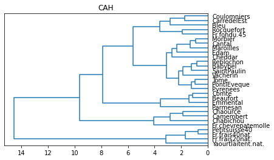
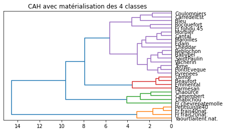
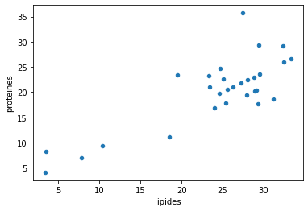
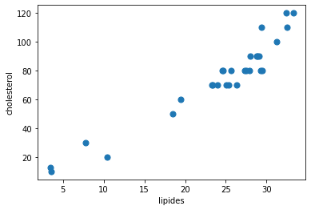
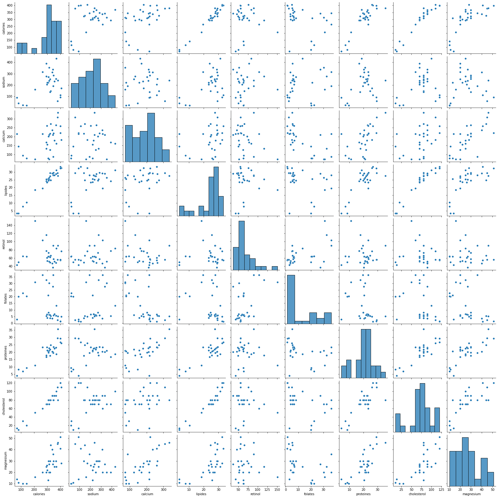
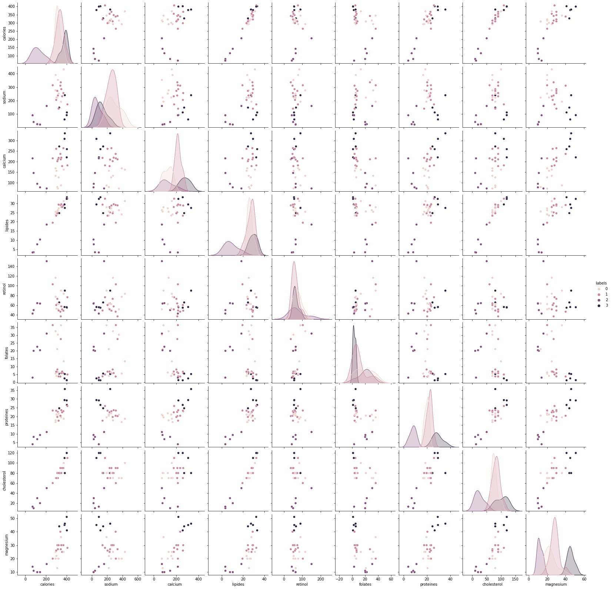

# TP - Classification automatique

### Objectif du TP
> Le but du tp est de mettre en pratique un algorithme de classification automatique du type CAH. Ici, il s'agira de regrouper les éléments du dataset en groupes, appelés clusters, afin de faire ressortir les patterns cachés dans le jeu de données en regroupant les éléments qui se ressemblent.

### Description du dataset
> ```fromage2.txt``` : Ensemble de différents fromages classifiés par leurs propriétés nutritives. Il s'agira donc d'identifier des groupes de fromages homogènes, ayant des caractéristiques similaires


### Étapes clés de l'analyse
- 1 : Chargement et description des données
- 2 : Centrage et réduction des données
- 3 : Génération de la matrice des liens
- 4 : Matérialisation des groupes
-

### Intérêt d'utiliser jupyter & Anaconda
>  Jupyter permet d'éditer des visualisations, de les partager et de permettre des modifications interactives du code et de l'ensemble des données partagés

#### BONUS RÉALISÉ - ```KMeans_clusters_fromage2_FOUNOU_Samir.ipynb```

## 1 - Chargement et description des données


```python
#modification du dossier par défaut
import os
os.chdir("/home/ubuntu/Documents/DATAMINING/")
```

> Ici on importe la librairie ```os``` qui permet d'effectuer des opérations courantes liées au système d'exploitation. Ainsi on pourra pointer sur le dossier voulu.


```python
#importation des données
import pandas
fromage = pandas.read_table("fromage2.txt",sep="\t",header=0,index_col=0)
```


```python
#dimension des données
print(fromage.shape)
```

    (29, 9)


```python
#6 premières lignes des données
print(fromage.iloc[0:6,:])
```

                 calories  sodium  calcium  lipides  retinol  folates  proteines  \
    Fromages                                                                       
    CarredelEst       314   353.5     72.6     26.3     51.6     30.3       21.0   
    Babybel           314   238.0    209.8     25.1     63.7      6.4       22.6   
    Beaufort          401   112.0    259.4     33.3     54.9      1.2       26.6   
    Bleu              342   336.0    211.1     28.9     37.1     27.5       20.2   
    Camembert         264   314.0    215.9     19.5    103.0     36.4       23.4   
    Cantal            367   256.0    264.0     28.8     48.8      5.7       23.0   
    
                 cholesterol  magnesium  
    Fromages                             
    CarredelEst           70         20  
    Babybel               70         27  
    Beaufort             120         41  
    Bleu                  90         27  
    Camembert             60         20  
    Cantal                90         30  


```python
#statistiques descriptives
print(fromage.describe())
```

             calories      sodium     calcium    lipides     retinol    folates  \
    count   29.000000   29.000000   29.000000  29.000000   29.000000  29.000000   
    mean   300.034483  210.086207  185.734483  24.158621   67.562069  13.010345   
    std     91.914356  108.678923   72.528882   8.129642   24.163098  11.723339   
    min     70.000000   22.000000   72.600000   3.400000   37.100000   1.200000   
    25%    292.000000  140.000000  132.900000  23.400000   51.600000   4.900000   
    50%    321.000000  223.000000  202.300000  26.300000   62.300000   6.400000   
    75%    355.000000  276.000000  220.500000  29.100000   76.400000  21.100000   
    max    406.000000  432.000000  334.600000  33.300000  150.500000  36.400000   
    
           proteines  cholesterol  magnesium  
    count  29.000000    29.000000  29.000000  
    mean   20.168966    74.586207  26.965517  
    std     6.959788    28.245755  11.318388  
    min     4.100000    10.000000  10.000000  
    25%    17.800000    70.000000  20.000000  
    50%    21.000000    80.000000  26.000000  
    75%    23.400000    90.000000  30.000000  
    max    35.700000   120.000000  51.000000  


## 2 - Centrage et réduction des données


```python
import pandas
```


```python
#centrage réduction des données
from sklearn import preprocessing
fromage_cr = preprocessing.scale(fromage)
```

> Ici on importe la librairie ```preprocessing``` qui permet d'éffectuer le prétraitement des données qui est la première étape d'apprentissage automatique au cours de laquelle les données brutes sont transformées  en un format utilisable pour mettre en oeuvre des modèles d'apprentissage automatique précis.
Ensjuite on fait appel à la méthode ```scale()``` qui permet de placer les données sur une seule échelle.

## 3 - Génération de la matrice des liens


```python
#librairies pour la CAH
import matplotlib.pyplot as plt
from scipy.cluster.hierarchy import dendrogram, linkage, fcluster
```


```python
#générer la matrice des liens
Z = linkage(fromage_cr,method='ward',metric='euclidean')
```

> Ici on utilise la méthode ```linkage()``` qui permet d'effectuer un clustering hiérarchique.

<u><em>Paramètres de la méthode</em></u>
- <strong>method='ward'</strong> &nbsp;&nbsp;&nbsp;&nbsp;&nbsp;&nbsp;: permet de calculer la distance entre les clusters. La méthode 'ward' utilise l'algorithme de minimisation de la variance de Ward
- <strong>metric='euclidean'</strong> : permet de définir la métrique qui sera utilisée. Ici c'est la métrique euclidienne par paire qui est utilisée


```python
plt.title("CAH")
dendrogram(Z,labels=fromage.index,orientation='left',color_threshold=0)
plt.show()
```


    

    


> Ici on construit un dendrogramme qui permet d'illustrer les arrangements de groupes générés par un regroupement ascendant hiérarchique.

## 4 - Matérialisation des groupes


```python
#matérialisation des 4 classes (hauteur t = 7)
plt.title('CAH avec matérialisation des 4 classes')
dendrogram(Z,labels=fromage.index,orientation='left',color_threshold=7)
plt.show()
```


    

    


> Ici on métérialise les quatres groupes de fromages, en spécifiant la hauteur à 7.


```python
#découpage à la hauteur t = 7 ==> 4 identifiants de groupes obtenus
groupes_cah = fcluster(Z,t=7,criterion='distance')
print(groupes_cah)
```

    [4 4 3 4 2 4 2 2 4 3 4 4 3 2 4 1 1 4 4 3 1 4 4 4 4 4 4 4 1]


### Interprétation du graphique :
On peut constater qu'à la hauteur t = 7, nous avons 4 familles de fromages qui se déssinent :
- Groupe de couleur orange : Constitué de fromages frais
- Groupe de couleur vert   : Constitué de fromages à pâte molle
- Groupe de couleur rouge  : Constitué de fromages consistant
- Groupe de couleur violet : Constitué de plusieurs types de fromages

<strong>Remarques :</strong> 
- IL serait intérressant de pousser l'analyse sur les fromages du groupe violet, afin de segmenter encore plus ces différents types de fromages
- Il serait opportun aussi, de comparer si ces 4 groupes de fromages représentent les différents clusters (n_clusters=4) trouvés précedemment dans l'algorithme K-Means

<strong>Conclusion :</strong> 
- Le bon nombre de cluster sur le jeux de données est donc de quatre.


```python

```


```python

```

# TP - BONUS - KMeans

### Objectif du TP
> Le but du tp est de mettre en pratique un algorithme de clustering (K-means). Ici, il s'agira de regrouper les éléments du dataset en groupes, appelés clusters, afin de faire ressortir les patterns cachés dans le jeu de données en regroupant les éléments qui se ressemblent.

### Description du dataset
> ```fromage2.txt``` : Ensemble de différents fromages classifiés par leurs propriétés nutritives. Il s'agira donc d'identifier des groupes de fromages homogènes, ayant des caractéristiques similaires

### Étapes clés de l'analyse
- 1 : Chargement et description des données
- 2 : Standardisation
- 3 : Clustering en 4 groupes

## 1 - Chargement et description des données


```python
# Définir le dossier
import os
os.chdir("/home/ubuntu/Documents/DATAMINING/")
```

> Ici on importe la librairie ```os``` qui permet d'effectuer des opérations courantes liées au système d'exploitation. Ainsi on pourra pointer sur le dossier voulu.


```python
# Chargement des données
import pandas
D = pandas.read_table("fromage2.txt",sep="\t",header=0,index_col=0)
D.info()
```

    <class 'pandas.core.frame.DataFrame'>
    Index: 29 entries, CarredelEst to Yaourtlaitent.nat.
    Data columns (total 9 columns):
     #   Column       Non-Null Count  Dtype  
    ---  ------       --------------  -----  
     0   calories     29 non-null     int64  
     1   sodium       29 non-null     float64
     2   calcium      29 non-null     float64
     3   lipides      29 non-null     float64
     4   retinol      29 non-null     float64
     5   folates      29 non-null     float64
     6   proteines    29 non-null     float64
     7   cholesterol  29 non-null     int64  
     8   magnesium    29 non-null     int64  
    dtypes: float64(6), int64(3)
    memory usage: 2.3+ KB


> Ici on importe la librairie ```pandas``` qui permet la manipulation et l'analyse des données. Ce qui nous permet de lire fichier texte ```fromage.txt```


```python
# Premières lignes
D.head()
```


<div>
<style scoped>
    .dataframe tbody tr th:only-of-type {
        vertical-align: middle;
    }

    .dataframe tbody tr th {
        vertical-align: top;
    }

    .dataframe thead th {
        text-align: right;
    }
</style>
<table border="1" class="dataframe">
  <thead>
    <tr style="text-align: right;">
      <th></th>
      <th>calories</th>
      <th>sodium</th>
      <th>calcium</th>
      <th>lipides</th>
      <th>retinol</th>
      <th>folates</th>
      <th>proteines</th>
      <th>cholesterol</th>
      <th>magnesium</th>
    </tr>
    <tr>
      <th>Fromages</th>
      <th></th>
      <th></th>
      <th></th>
      <th></th>
      <th></th>
      <th></th>
      <th></th>
      <th></th>
      <th></th>
    </tr>
  </thead>
  <tbody>
    <tr>
      <th>CarredelEst</th>
      <td>314</td>
      <td>353.5</td>
      <td>72.6</td>
      <td>26.3</td>
      <td>51.6</td>
      <td>30.3</td>
      <td>21.0</td>
      <td>70</td>
      <td>20</td>
    </tr>
    <tr>
      <th>Babybel</th>
      <td>314</td>
      <td>238.0</td>
      <td>209.8</td>
      <td>25.1</td>
      <td>63.7</td>
      <td>6.4</td>
      <td>22.6</td>
      <td>70</td>
      <td>27</td>
    </tr>
    <tr>
      <th>Beaufort</th>
      <td>401</td>
      <td>112.0</td>
      <td>259.4</td>
      <td>33.3</td>
      <td>54.9</td>
      <td>1.2</td>
      <td>26.6</td>
      <td>120</td>
      <td>41</td>
    </tr>
    <tr>
      <th>Bleu</th>
      <td>342</td>
      <td>336.0</td>
      <td>211.1</td>
      <td>28.9</td>
      <td>37.1</td>
      <td>27.5</td>
      <td>20.2</td>
      <td>90</td>
      <td>27</td>
    </tr>
    <tr>
      <th>Camembert</th>
      <td>264</td>
      <td>314.0</td>
      <td>215.9</td>
      <td>19.5</td>
      <td>103.0</td>
      <td>36.4</td>
      <td>23.4</td>
      <td>60</td>
      <td>20</td>
    </tr>
  </tbody>
</table>
</div>


```python
# Nuage de points entre les protéines et les lipides
D.plot(x="lipides", y="proteines", kind="scatter")
```


    <AxesSubplot:xlabel='lipides', ylabel='proteines'>


    

    


```python
# Nuage de points entre les protéines et les cholesterols
D.plot(x="lipides", y="cholesterol", kind="scatter", s=50)
```


    <AxesSubplot:xlabel='lipides', ylabel='cholesterol'>


    

    


> Ici on utilise la méthode ```plot()``` de la librairie ```pandas``` qui permet de tracer des courbes qui relient des points dont les abscisses et ordonnées sont sélectionnées au préalable.


```python
# Nuage par paire
import seaborn as sns
sns.pairplot(D)
```


    <seaborn.axisgrid.PairGrid at 0x7fbf03ac2c70>


    

    


> Ici on importe la librairie ```seaborn``` qui est une bibliothèque de visualisation de données Python basée sur matplotlib . Il fournit une interface de haut niveau pour dessiner des graphiques statistiques attrayants et informatifs. On fait appel ensuite à la méthode ```pairplot()``` qui permet de tracer des relations par paires dans un ensemble de données.

### Interprétation du graphique :
<em>Ici on peut constater des corrélations potentielles : </em>
- Protéines - Lipides
- Protéines - Calcium 
- Calories &nbsp;&nbsp;- Lipdes 
- etc...

> <strong>Remarque</strong> : On peut voir que des groupes semblent apparaître naturellement. C'est ce que tentera de démontrer la suite du code.

## 2 - Standardisation

<strong>Objectif de la standardisation</strong> : <br>
Il est recommandé de normaliser les données, cela permettra par la suite de déterminer plus facilement les clusters (groupes) grâce aux k-means (moyennes) 


```python
# Moyennes par variable
D.mean(axis=0)
```


    calories       300.034483
    sodium         210.086207
    calcium        185.734483
    lipides         24.158621
    retinol         67.562069
    folates         13.010345
    proteines       20.168966
    cholesterol     74.586207
    magnesium       26.965517
    dtype: float64


```python
# Écarts-type par variable
D.std(axis=0)
```


    calories        91.914356
    sodium         108.678923
    calcium         72.528882
    lipides          8.129642
    retinol         24.163098
    folates         11.723339
    proteines        6.959788
    cholesterol     28.245755
    magnesium       11.318388
    dtype: float64


```python
# Standardisation
Z = (D - D.mean(axis=0)) / D.std(axis=0)
print(Z)
```

                        calories    sodium   calcium   lipides   retinol  \
    Fromages                                                               
    CarredelEst         0.151941  1.319610 -1.559854  0.263404 -0.660597   
    Babybel             0.151941  0.256846  0.331806  0.115796 -0.159833   
    Beaufort            1.098474 -0.902532  1.015671  1.124450 -0.524025   
    Bleu                0.456572  1.158585  0.349730  0.583221 -1.260686   
    Camembert          -0.392044  0.956154  0.415910 -0.573041  1.466614   
    Cantal              0.728564  0.422472  1.079094  0.570920 -0.776476   
    Chabichou           0.478331 -0.166419 -1.358555  0.460215  0.932742   
    Chaource           -0.087413  0.606500 -0.728461  0.152698  2.021178   
    Cheddar             1.152872 -0.350447 -0.047353  1.026045  0.365762   
    Comte               1.076714 -1.086560  0.479333  1.013744 -0.482640   
    Coulomniers         0.086662  0.109624 -1.468856  0.177299 -0.163972   
    Edam                0.293377 -0.571281  1.192153  0.066593 -0.077063   
    Emmental            0.848241 -1.381006  1.688507  0.644724 -0.466085   
    Fr.chevrepatemolle -1.023066 -0.460864 -1.557097 -0.696048  3.432421   
    Fr.fondu.45        -0.087413  1.655462 -0.237622 -0.019511  0.407147   
    Fr.frais20nat.     -2.393908 -1.555833 -0.543707 -2.541148 -0.726814   
    Fr.frais40nat.     -2.013118 -1.703055 -1.253769 -2.012219 -0.135002   
    Maroilles           0.413053  0.928550  0.702693  0.607822 -0.863386   
    Morbier             0.510970  0.689313  0.458652  0.657025 -0.412284   
    Parmesan            0.880880  0.275249  2.052500  0.411012  0.928603   
    Petitsuisse40      -1.719367 -1.730659 -1.482644 -1.692402 -0.172249   
    PontlEveque        -0.000375  0.118825 -0.400316 -0.093315 -0.602657   
    Pyrenees            0.598008  0.201638 -0.094231  0.472515 -0.664736   
    Reblochon           0.097542  0.569695  0.228399  0.054293  0.229190   
    Rocquefort          0.761203  2.041921 -0.327242  0.866136  0.659598   
    SaintPaulin        -0.022135 -0.046800  1.037732 -0.105616 -0.296405   
    Tome                0.228098  0.385666 -0.830490  0.386411 -0.217773   
    Vacherin            0.228098 -0.644892  0.444864  0.632424 -0.759922   
    Yaourtlaitent.nat. -2.502705 -1.095762  0.413153 -2.553448 -1.020650   
    
                         folates  proteines  cholesterol  magnesium  
    Fromages                                                         
    CarredelEst         1.474806   0.119405    -0.162368  -0.615416  
    Babybel            -0.563862   0.349297    -0.162368   0.003047  
    Beaufort           -1.007422   0.924027     1.607810   1.239972  
    Bleu                1.235967   0.004459     0.545703   0.003047  
    Camembert           1.995136   0.464243    -0.516404  -0.615416  
    Cantal             -0.623572   0.406770     0.545703   0.268102  
    Chabichou           1.986606  -0.096119     0.191667   0.798213  
    Chaource            1.662466  -0.340379    -0.162368  -0.173657  
    Cheddar            -0.691812   0.837818     1.253774   0.091398  
    Comte              -0.998892   1.297602     1.607810   2.123490  
    Coulomniers         0.690047   0.047564     0.191667  -1.233879  
    Edam               -0.640632   0.651031     0.191667   1.505027  
    Emmental           -0.905062   1.326339     1.253774   1.593379  
    Fr.chevrepatemolle  1.534516  -1.303052    -0.870439  -0.968823  
    Fr.fondu.45        -0.640632  -0.484062    -0.162368  -0.615416  
    Fr.frais20nat.      0.596217  -1.705363    -2.286581  -1.410582  
    Fr.frais40nat.      0.817997  -1.892150    -1.578510  -1.498934  
    Maroilles          -0.802702   0.033196     0.545703   1.151620  
    Morbier            -0.615042   0.492980     0.191667   0.268102  
    Parmesan           -0.666222   2.231539     0.191667   1.681731  
    Petitsuisse40       0.630337  -1.547312    -1.932546  -1.498934  
    PontlEveque        -0.768582   0.133773    -0.162368  -0.438712  
    Pyrenees           -0.529742   0.320561     0.545703  -0.173657  
    Reblochon          -0.418852  -0.067382     0.191667   0.268102  
    Rocquefort          0.024708  -0.211065     0.899739  -0.173657  
    SaintPaulin        -0.538272   0.449875    -0.162368  -0.085305  
    Tome               -0.580922   0.234351     0.191667  -0.615416  
    Vacherin           -0.794172  -0.369115     0.191667   0.268102  
    Yaourtlaitent.nat. -0.862412  -2.308830    -2.180370  -1.145527  


```python
# Vérification de la standardisation - moyennes
Z.mean(axis=0)
```


    calories      -7.656711e-17
    sodium         1.071939e-16
    calcium        4.689735e-16
    lipides        3.368953e-16
    retinol        3.828355e-17
    folates       -2.679849e-17
    proteines      9.188053e-17
    cholesterol   -1.990745e-16
    magnesium      9.953724e-17
    dtype: float64


```python
# Vérification - écarts-type
Z.std(axis=0)
```


    calories       1.0
    sodium         1.0
    calcium        1.0
    lipides        1.0
    retinol        1.0
    folates        1.0
    proteines      1.0
    cholesterol    1.0
    magnesium      1.0
    dtype: float64


## 3 - Clustering en quatre groupes


```python
# K-means avec 4 groupes
from sklearn import cluster

res = cluster.KMeans(n_clusters=4)

```

> Ici on créé le modèle avec le nombre de clusters que l'on veut avoir grâce à la méthode ```KMeans()```. 

<u><em>Paramètres de la méthode : </em></u>
- <strong>n_clusters :</strong> permet de définir le nombre de clusters désirés. Nous choisirons 4 clusters
- <strong>n_init :</strong> permet de définir le nombre d'initalisation que l'on veut avoir, c'est à dire le nombre de fois que l'algorithme sera exécuté. Par défaut le nombre est fixé à 10
- <strong>max_iter :</strong> permet de définir le nombre d'itérations max. Par défaut le nimbre est fixé à 300
- <strong>init :</strong> permet de choisir la stratégie d'initialisation qui sera utilisée. Par défaut c'est la méthode K-Means++  qui est paramétrée, qui est une méthode d'initialisation qui consiste à placer les centroids sur des points du dataset les uns les autres, ce qui facilitera la convergence des centroids vers des positions d'équilibre


```python
res.fit(Z)
```


    KMeans(n_clusters=4)


> Ici on utilise la méthode ```fit()``` qui permettra d'entraîner le dataset 
res.predict(Z)
> Ici la méthode ```pedict()``` permettra de voir comment sont classés les échantillons


```python
# num de cluster affectés aux groupes
res.labels_
```


    array([0, 1, 3, 1, 1, 1, 0, 0, 1, 3, 0, 3, 3, 2, 0, 2, 2, 1, 1, 3, 2, 0,
           1, 1, 0, 1, 0, 1, 2], dtype=int32)


```python
# Éffectifs par groupe
import numpy
numpy.unique(res.labels_, return_counts=True)
```


    (array([0, 1, 2, 3], dtype=int32), array([ 8, 11,  5,  5]))


```python
# Rajouter la variable au data-frame initial
B = D.copy()
B['labels'] = res.labels_
# Configuration des points dans le plan
# Des variables prises par paires
sns.pairplot(B,hue="labels")
```


    <seaborn.axisgrid.PairGrid at 0x7fbf03c2ae20>


    

    


### Interprétation du graphique :
<em>Ici on peut constater visuellement les quatre clusters déterminés plus haut. Ce type de visualisation facilite grandement l'interprétation des données.</em>

<hr>


```python
# Moyennes par groupe
gb = D.groupby(res.labels_)
# Éffectifs par classe
gb.size()
```


    0     8
    1    11
    2     5
    3     5
    dtype: int64


> Ici on peut voir le nombre total de fromage par cluster

<hr>


```python
# Moyennes par classe
gb.mean()
```


<div>
<style scoped>
    .dataframe tbody tr th:only-of-type {
        vertical-align: middle;
    }

    .dataframe tbody tr th {
        vertical-align: top;
    }

    .dataframe thead th {
        text-align: right;
    }
</style>
<table border="1" class="dataframe">
  <thead>
    <tr style="text-align: right;">
      <th></th>
      <th>calories</th>
      <th>sodium</th>
      <th>calcium</th>
      <th>lipides</th>
      <th>retinol</th>
      <th>folates</th>
      <th>proteines</th>
      <th>cholesterol</th>
      <th>magnesium</th>
    </tr>
  </thead>
  <tbody>
    <tr>
      <th>0</th>
      <td>317.625000</td>
      <td>292.5625</td>
      <td>123.075000</td>
      <td>26.387500</td>
      <td>74.737500</td>
      <td>18.650000</td>
      <td>19.650000</td>
      <td>77.500000</td>
      <td>22.625000</td>
    </tr>
    <tr>
      <th>1</th>
      <td>332.818182</td>
      <td>251.0000</td>
      <td>218.090909</td>
      <td>27.145455</td>
      <td>60.681818</td>
      <td>10.509091</td>
      <td>22.018182</td>
      <td>82.727273</td>
      <td>28.454545</td>
    </tr>
    <tr>
      <th>2</th>
      <td>122.600000</td>
      <td>67.8000</td>
      <td>121.560000</td>
      <td>8.720000</td>
      <td>74.220000</td>
      <td>19.380000</td>
      <td>7.980000</td>
      <td>24.600000</td>
      <td>12.200000</td>
    </tr>
    <tr>
      <th>3</th>
      <td>377.200000</td>
      <td>130.4000</td>
      <td>278.980000</td>
      <td>29.460000</td>
      <td>64.560000</td>
      <td>3.120000</td>
      <td>29.120000</td>
      <td>102.000000</td>
      <td>45.400000</td>
    </tr>
  </tbody>
</table>
</div>


> Ici on peut voir la moyenne de chaque nutriment pour chaque cluster.


```python

```
